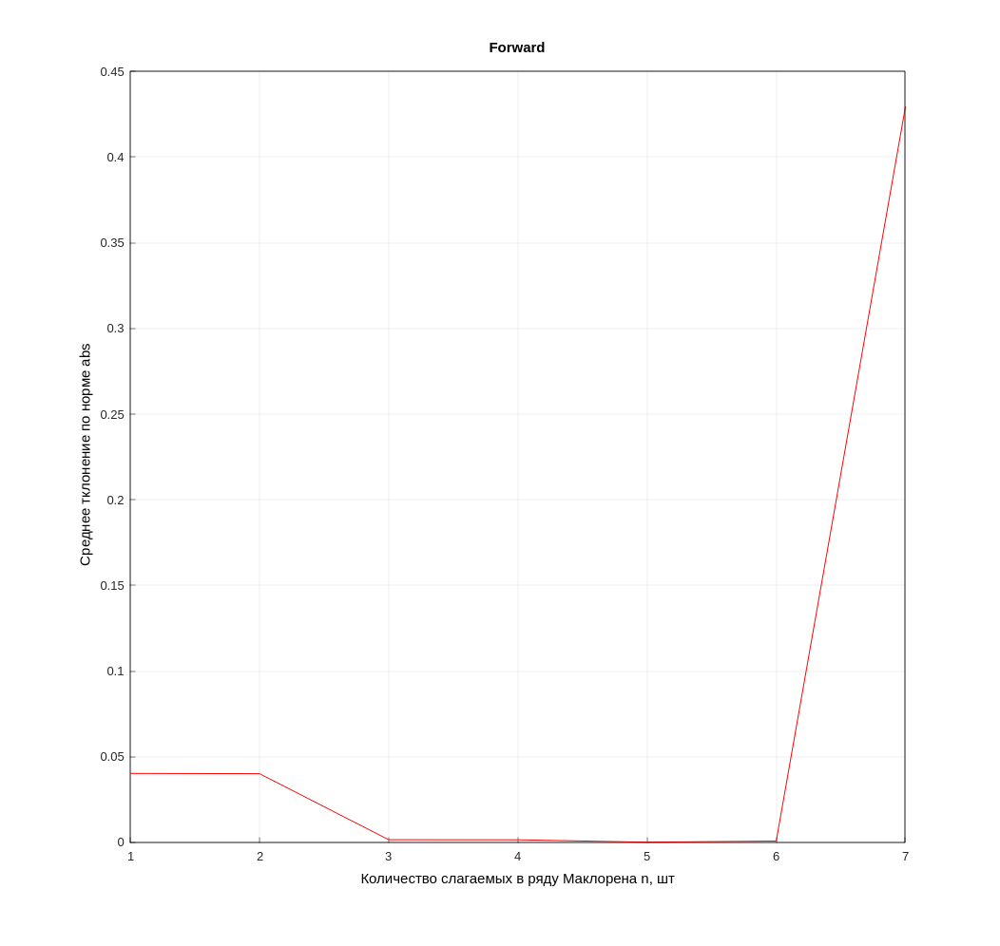
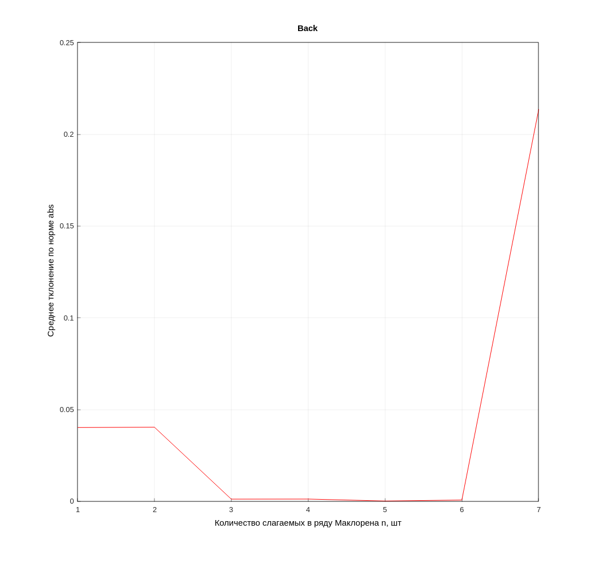
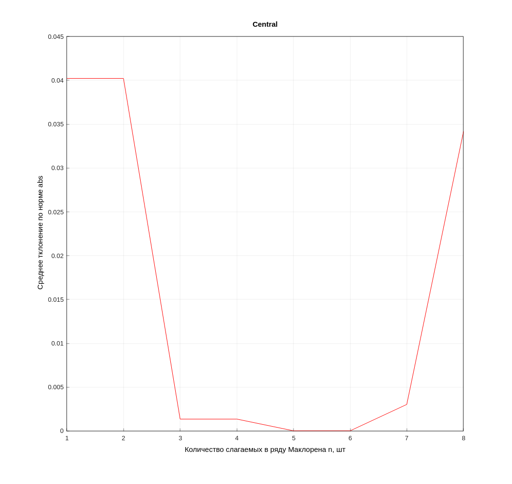
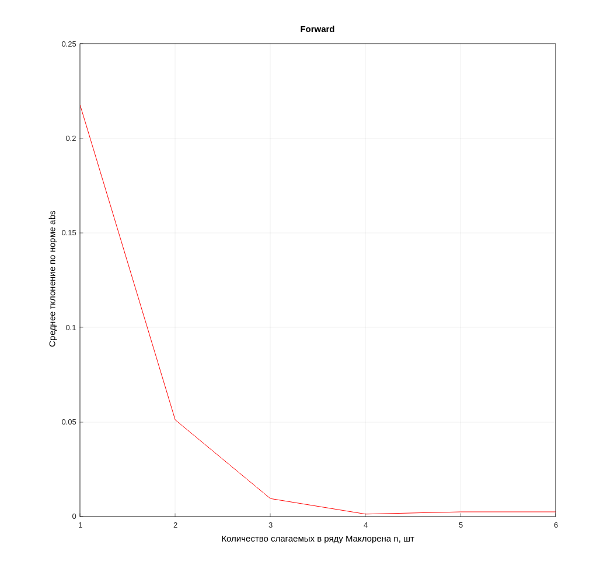
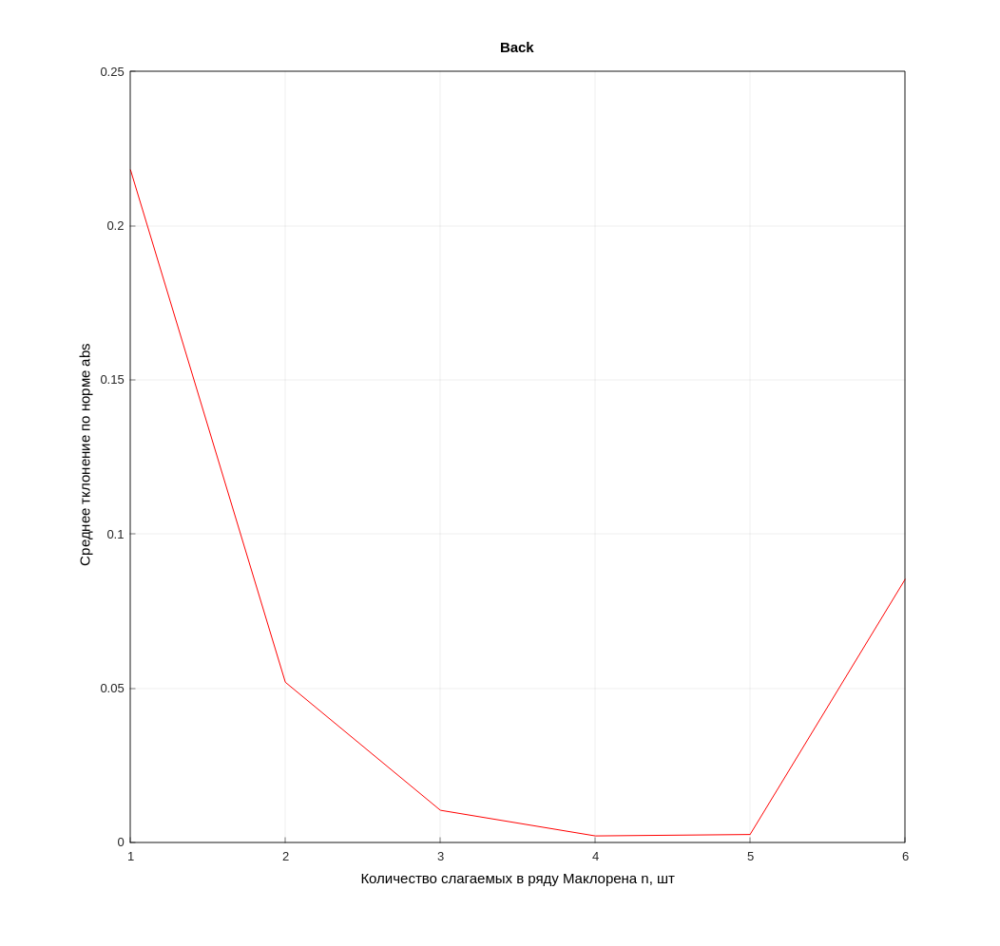
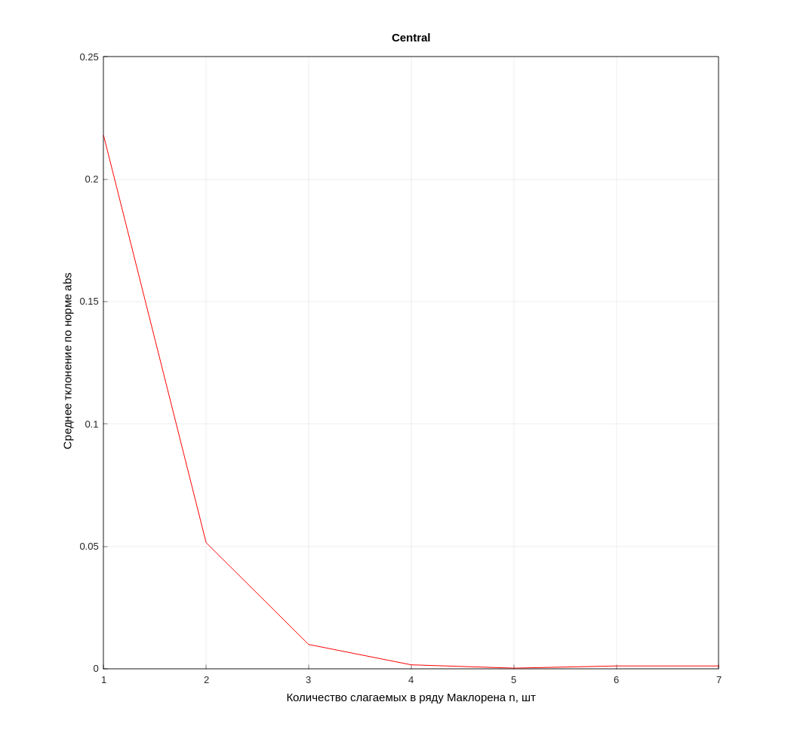

# Задача 1.
## Пусть для вычисления функции u = f (t) используется частичная сумма ряда Маклорена причем аргумент задан с погрешностью $\Delta t = 10^{-3}$. Найти $n$ такое, чтобы погрешность в определении функции $u(t)$ по данной формуле не превышала $\Delta t$ из отрезка $[0,1]$. Построить график ошибки в зависимости от порядка производной. Рассмотреть в качеcтве $u(x)$ функции $u(x)=sin(x)$ и $u(x)=e^x$.
<br>

### При решении поставленной задачи была использована библиотека matplotplusplus (необходима для компиляции). В приложенном проекте уже присутствуют скомпилированные файлы под Windows и Linux в соответсвующей директории(./bins).
### Для компиляции написанного кода воспользуйтесь коммандами:
```
mkdir build && cd build
cmake .. && cmake --build ./
```
### 

### Полученные результаты:
#### Были рассмотрены две функции (для смены функции используется define) и три различных численнных метода вычисления производной. Соответсвующие изображения:
#### $u(x)=sin(x)$, производная вперед

#### $u(x)=sin(x)$, производная назад

#### $u(x)=sin(x)$, центральная разность


#### $u(x)=e^x$, производная вперед

#### $u(x)=e^x$, производная назад

#### $u(x)=e^x$, центральная разность
